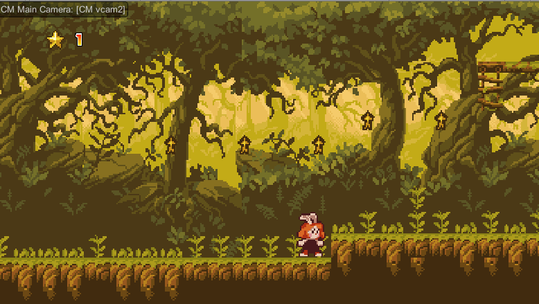

# Unity3D 게임 만들기

[한국 컨텐츠 아카데미](https://edu.kocca.kr/edu/main/main.do) 온라인 교육 *'Unity3D 게임 만들기'* 예제 프로젝트 파일.

  

## Chapter

온라인 강의는 다음 목차로 구성되어 있습니다.

1. Unity3D 에디터 인터페이스
* 2D 타일맵 에디터
* 물리 시스템
* 카메라와 입력처리
* 재질(Material)
* 캐릭터 애니메이션
* 스크립팅

## Credit & License

This is distributed under the terms and conditions of the MIT license.

Except the followings:
* [*Sunnyland*](https://opengameart.org/content/sunnyland-forest) - All artwork is created by Luis Zuno. This piece is under a [CC-BY-3.0](http://creativecommons.org/licenses/by/3.0/) License.
* All any other packages from [AssetStore](https://assetstore.unity.com/) follows on their own license policy.
